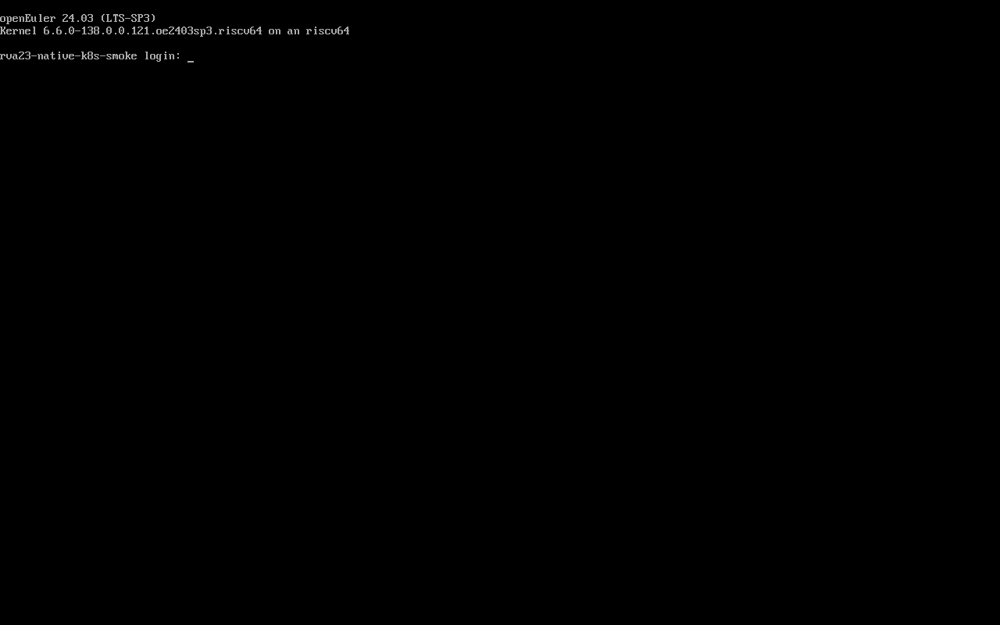

# 原生 Kubernetes + Cloudpods RVA23 验证记录

验证日期：2026-08-21
验证方式：x86_64 Runner 上运行 QEMU system RISC-V RVA23，验证机内使用嵌套 KVM

## 验证环境

| 项目 | 实际值 |
| --- | --- |
| x86 验证宿主 | `10.230.50.202`（`RISC-V-Github-Runner-02`） |
| 宿主资源 | 32 vCPU、约 64 GiB 内存、约 1 TiB 磁盘 |
| QEMU system | `10.2.1`，TCG 多线程 |
| RISC-V CPU 模型 | `rva23s64,sv39=on` |
| 主验证机 | `cloudpods-rva23-cp`，12 vCPU、24 GiB 内存、160 GiB 磁盘，`192.168.123.10` |
| 计算验证机 | `cloudpods-rva23-compute01`，8 vCPU、16 GiB 内存、120 GiB 磁盘，`192.168.123.11` |
| 验证机系统 | openEuler 24.03 LTS SP3 RVA23 `riscv64` |
| 验证机内核 | `6.6.0-138.0.0.121.oe2403sp3.riscv64` |
| Kubernetes | openEuler 原生 `v1.29.1` |
| Cloudpods | `v4.0.3-riscv64.6` |
| Cloudpods QEMU | `10.0.7` |

验证机使用 openEuler 官方 RVA23 镜像、`RISCV_VIRT_CODE_RVA23.fd` 和 `RISCV_VIRT_VARS_RVA23.fd`。宿主准备及启动脚本位于 `native-k8s/qemu-rva23-lab/`。

## 已验证项目

| 验证项 | 结果 |
| --- | --- |
| QEMU `rva23s64` CPU 模型启动 | 通过 |
| openEuler SP3 RVA23 启动及 SSH | 通过 |
| 验证机内 `/dev/kvm`、H 扩展、Sv39x4、14-bit VMID | 通过 |
| QEMU 10.0.7 通过嵌套 KVM 启动第二层 RISC-V Linux 内核 | 通过 |
| 原生 Kubernetes API `/readyz` | 通过 |
| `kubeadm join` 添加计算节点 | 通过 |
| 两个 Kubernetes Node `Ready`、架构 `riscv64` | 通过 |
| 节点 PodCIDR `10.244.0.0/24`、`10.244.1.0/24` 及双向持久路由 | 通过 |
| 两节点各启动一个普通 Pod，Pod IP 全互 ping | 通过 |
| 两个 CoreDNS Pod `Running` | 通过 |
| Cloudpods Operator、控制面、Web/HTTPS | 通过 |
| Cloudpods Host 检测 QEMU 10.0.7 和 KVM 最大 12 vCPU | 通过 |
| Cloudpods Host 注册并在线 | 通过 |
| 两个 Cloudpods Host `running/online/enabled` | 通过 |
| Cloudpods 创建并启动 RISC-V 虚拟机 | 通过 |
| 两个节点正常关机/启动后自动恢复并重复执行完整验收 | 通过 |

## 真实虚拟机验收

| 项目 | 实际值 |
| --- | --- |
| 虚拟机 | `rva23-native-k8s-smoke` |
| Cloudpods 状态 | `running`，电源 `on`，QGA `available` |
| 架构与固件 | `riscv64`、UEFI |
| 规格 | 2 vCPU、4 GiB 内存、45 GiB 本地系统盘 |
| 网络 | `rva23-guest-test`，`192.168.123.119/24` |
| 最终控制台 | openEuler 24.03 LTS SP3 登录提示，内核显示 `riscv64 on a riscv64` |



验收脚本最终输出 `CLOUDPODS_NATIVE_K8S_ACCEPTANCE_OK`。该结果同时校验 Kubernetes API、Node、CoreDNS、全部 Cloudpods Pod/DaemonSet、QEMU 10.0.7、真实 KVM 内核启动、HTTPS 和已启用 Host。

## 验证中修复的问题

1. openEuler 官方最小 RVA23 镜像初始没有 `/etc/selinux/config`，安装 MariaDB/Open vSwitch 又会带入 SELinux policy，并在下次启动变为 enforcing，导致 sshd 安全域切换失败。运行时和 Host 前置脚本现分别在依赖安装前后处理该状态，固定为 permissive；双节点重启后的 SSH 已复验。
2. Cloudpods Host 必须使用 `br0` 作为 `listen_interface`，同时通过 `物理网卡/br0/管理IP` 显式指定管理网络，避免双网卡服务器误选外联网卡。
3. Host 首次注册前必须存在覆盖宿主管理 IP 的 classic baremetal 子网。安装脚本现先创建管理子网，再启用 Host 标签。
4. API Gateway 已使用 NodePort `30443`，Web HTTPS 改用内部 NodePort `30444`，再由 systemd 代理到标准端口 443。
5. QEMU TCG 强制重启会留下零长度 CNI 缓存；该现象属于验证机异常断电恢复，不是正常部署流程。
6. openEuler Kubernetes 1.29 将 bootstrap signer 和 token cleaner controller 默认关闭，原生 systemd 控制面现显式启用两者，同时启用 API Server bootstrap-token 认证，标准 `kubeadm join` 已通过。
7. 双 RVA23 TCG 验证机使用 QEMU UDP multicast 链路时在高负载下发生丢包。验证脚本现支持 `listen/connect` 点对点 socket 链路，实测 0% 丢包；客户物理机仍按管理网二层互通部署。
8. 最小系统缺少 `crictl` 和 `ebtables`。基础包脚本已补充 `cri-tools` 和 `ebtables` 并纳入验收。
9. API Server 默认优先按 hostname 访问 Kubelet，现场无节点 DNS 时无法读取计算节点日志。控制面现优先使用 Node `InternalIP`。
10. OVS `brlocal` 在节点重启后可能丢失 `169.254.0.0/16` 地址，导致 Host 进程拒绝启动。Host 前置脚本现安装持续校正服务，双 Host 重启后均恢复就绪。

## 复现 RVA23 验证机

在空闲的 Ubuntu x86_64 Runner 以 root 执行：

```bash
git clone --depth 1 --branch native-k8s-v4.0.3-riscv64.1 \
  https://github.com/yinjiayi/cloudpods-riscv64-releases.git
cd cloudpods-riscv64-releases/native-k8s/qemu-rva23-lab
./prepare-host.sh
CLUSTER_SOCKET_MODE=listen CLUSTER_SOCKET_ADDRESS=127.0.0.1:12346 \
  ./launch-node.sh

NODE_NAME=cloudpods-rva23-compute01 NODE_INDEX=2 \
NODE_IP=192.168.123.11 SSH_PORT=2203 HTTP_PORT=2081 HTTPS_PORT=2444 \
APISERVER_PORT=26444 VCPUS=8 MEMORY_MIB=16384 DISK_SIZE=120G \
CLUSTER_SOCKET_MODE=connect CLUSTER_SOCKET_ADDRESS=127.0.0.1:12346 \
  ./launch-node.sh
```

默认端口映射：SSH `2202`、HTTP `2080`、HTTPS `2443`、Kubernetes API `26443`。串口可通过以下命令连接：

```bash
nc -U /var/lib/cloudpods-rva23-lab/cloudpods-rva23-cp/serial.sock
```

验证结束后先在验证机内执行 `systemctl poweroff`，确认 QEMU 退出，再恢复被临时停用的 Runner 服务。
